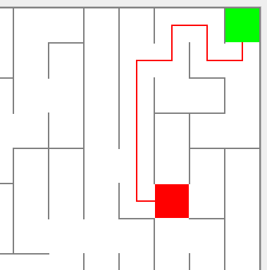

# Лабиринт

## https://github.com/InAnotherLife/Maze

## Стек: С++, Qt, паттерн MVC
## 1. Описание
Программа разработана на языке С++ стандарта C++17. Графический интерфейс создан при помощи фреймворка Qt версии 6.2. Программа реализована с использованием паттерна MVC.  
Код программы находится в папке src. Сборка осуществляется с помощью Makefile (цели all, install, uninstall, dist, tests, gcov_report, clean).  
Обеспечено покрытие кода unit-тестами с помощью библиотеки GTest.

## 2. Основные функции

Программа умеет загружать лабиринт из файла, генерировать лабиринт согласно алгоритму Эллера и сохранять сгенерированный лабиринт.  
Сгенерированный лабиринт не имеет изолированных областей и петель. Лабиринт отрисовывается в поле размером 500 x 500 пикселей.  
Программа показывает решение лабиринта. Для этого пользователем на экране указываются начальная и конечная точки.

